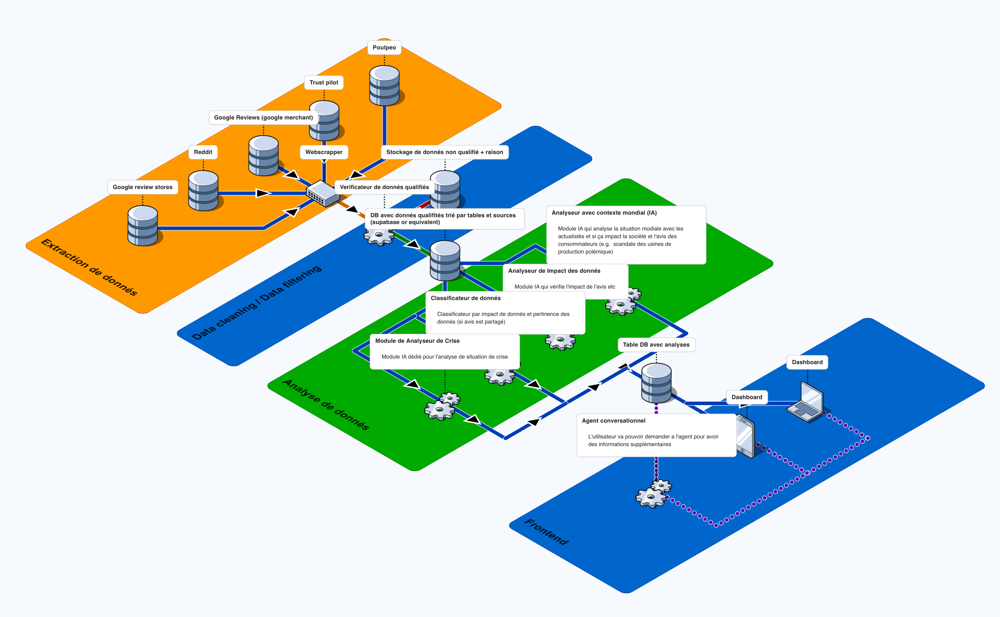

# Cartographie du Projet — Zara Social Data Intelligence

## Objectif

Visualiser le flux de travail et l'architecture technique du projet. Ce document modélise le parcours complet de la donnée : des sources ciblées jusqu'à l'exploitation finale, en passant par l'extraction, le nettoyage, l'analyse et la restitution.

---

## Schéma du Flux de Données

<!-- Insérer ici le schéma visuel (export Miro / FigJam) -->


---

## Détail du Parcours de la Donnée

### Step 1 - Sources Ciblées

Les données sont collectées depuis trois grandes catégories de sources :

**Avis & Réputation**
| Source | Type de donnée | Granularité |
|--------|---------------|-------------|
| Google Reviews | Avis clients en magasin | Par magasin |
| Google Merchant | Avis produits | Par produit |
| Trustpilot | Score de réputation | Marque |
| Autres plateformes d'avis | Avis tiers | Marque / Produit |

**Réseaux Sociaux & UGC**
| Source | Type de donnée |
|--------|---------------|
| Instagram | Posts, stories, mentions, hashtags, UGC |
| Facebook | Avis de page, commentaires, mentions |
| YouTube | Mentions vidéo, commentaires |
| Reddit | Threads, discussions, mentions |
| LinkedIn | Perception de marque, signaux employeur |

**Données Opérationnelles**
| Source | Type de donnée | Granularité |
|--------|---------------|-------------|
| Transporteurs | Performance logistique | Par transporteur / région |
| Retours produits | Taux et motifs de retour | Par magasin / par produit |

**Données Concurrentielles**
- Toutes les sources ci-dessus sont répliquées pour **H&M** afin de permettre un benchmark concurrentiel.

---

### Step 2 — Extraction & Automatisation

#### Outils d'extraction (Scripts Python)
| Outil | Usage |
|-------|-------|
| **Scrapy** | Scraping structuré à grande échelle (Trustpilot, avis externes) |
| **BeautifulSoup** | Parsing HTML pour sources simples |
| **Selenium / Playwright** | Scraping de pages dynamiques (Google Reviews, Google Merchant) |
| **PRAW** | API Reddit officielle |
| **YouTube Data API** | Extraction vidéos et commentaires YouTube |

#### Outils no-code / low-code (Apify)
| Acteur Apify | Usage |
|--------------|-------|
| Google Maps Scraper | Avis Google par magasin |
| Instagram Scraper | Posts, commentaires, hashtags |
| Facebook Scraper | Avis et commentaires de page |
| YouTube Scraper | Vidéos et commentaires |
| LinkedIn Scraper | Posts et engagement |
| Trustpilot Scraper | Avis et scores |
| Reddit Scraper | Threads et commentaires |

#### Automatisation & Scheduling
| Outil | Rôle |
|-------|------|
| **N8N** | Orchestration des workflows (OBLIGATOIRE) |

---

### Step 3 — Stockage des Données Brutes

Les données extraites sont stockées dans un **data lake** avant traitement :

| Couche | Technologie | Contenu |
|--------|-------------|---------|
| **Raw Storage** | PostgreSQL / BigQuery / S3 | Données brutes non traitées |
| **Format** | JSON / CSV / Parquet | Selon la source |
| **Organisation** | Par source, par date, par marque | Partitionnement logique |

---

### Step 4 — Nettoyage & Enrichissement

#### Pipeline de Nettoyage (Python)
| Étape | Description | Outils |
|-------|-------------|--------|
| Déduplication | Suppression des doublons | pandas / polars |
| Normalisation | Uniformisation des formats (dates, textes, encodages) | pandas, regex |
| Valeurs manquantes | Imputation ou suppression selon les règles | pandas |
| Détection de langue | Identification de la langue de chaque texte | langdetect |
| Validation | Contrôle qualité sur les données nettoyées | pytest, great_expectations |

#### Enrichissement
| Étape | Description | Outils |
|-------|-------------|--------|
| Géolocalisation | Tagging par pays / ville / région | geocoder |
| Classification | Catégorisation thématique des avis | spaCy, transformers |
| Extraction d'entités | Identification des produits, magasins, personnes mentionnés | spaCy NER |

**Stockage après nettoyage** → Base de données structurée (PostgreSQL / BigQuery) — données prêtes pour l'analyse.

---

### Step 5 — Analyse & Intelligence (Agents IA)

| Agent | Fonction | Output |
|-------|----------|--------|
| **Sentiment Agent** | Analyse du ton et du sentiment sur tous les textes | Score de sentiment par source / produit / magasin |
| **Crisis Detection Agent** | Détection d'anomalies et de crises potentielles | Alertes avec niveau de sévérité |
| **Product Health Agent** | Score de santé par produit (avis + retours + social) | Score 0-100 par produit |
| **Trend Agent** | Identification des tendances émergentes | Tendances avec score de confiance |
| **Competitive Agent** | Benchmark Zara vs H&M sur tous les KPIs | Scorecard comparatif |

---

### Step 6 — Exploitation & Restitution

#### Dashboard Interactif
- Visualisation des données (graphiques, cartes, timelines)
- Filtrage et drill-down par source, produit, magasin, période
- Vue positionnement concurrentiel (Zara vs H&M)

#### Magazine Investisseurs
- Rapport automatisé résumant la santé de la marque
- Généré mensuellement par un agent LLM
- Format PDF avec KPIs, graphiques et recommandations

#### Système d'Alertes
- Notifications en temps réel (Slack, email, dashboard)
- Seuils configurables par niveau de sévérité
- Escalade automatique selon la criticité

---

## Résumé du Flux

```
┌─────────────────────────────────────────────────────────────────────┐
│                        SOURCES DE DONNÉES                          │
│  Google Reviews · Google Merchant · Trustpilot · Instagram         │
│  Facebook · YouTube · Reddit · LinkedIn · UGC                      │
│  Transporteurs · Retours Produits                                  │
│  ────────────── Zara + H&M ──────────────                         │
└─────────────────────────┬───────────────────────────────────────────┘
                          │
                          ▼
┌─────────────────────────────────────────────────────────────────────┐
│                    EXTRACTION & AUTOMATISATION                      │
│  Python (Scrapy, Selenium, PRAW) │ Apify (actors no-code)         │
│  Orchestration: N8N (OBLIGATOIRE)                                  │
└─────────────────────────┬───────────────────────────────────────────┘
                          │
                          ▼
┌─────────────────────────────────────────────────────────────────────┐
│                    STOCKAGE BRUT (DATA LAKE)                       │
│  PostgreSQL / BigQuery / S3  —  JSON / CSV / Parquet               │
└─────────────────────────┬───────────────────────────────────────────┘
                          │
                          ▼
┌─────────────────────────────────────────────────────────────────────┐
│                  NETTOYAGE & ENRICHISSEMENT                         │
│  Pipeline Python (pandas/polars)                                    │
│  Déduplication · Normalisation · Enrichissement · Validation        │
└─────────────────────────┬───────────────────────────────────────────┘
                          │
                          ▼
┌─────────────────────────────────────────────────────────────────────┐
│                    STOCKAGE PROPRE                                  │
│  PostgreSQL / BigQuery  —  Données structurées & enrichies          │
└─────────────────────────┬───────────────────────────────────────────┘
                          │
                          ▼
┌─────────────────────────────────────────────────────────────────────┐
│                    ANALYSE (AGENTS IA)                              │
│  Sentiment · Crises · Santé Produit · Tendances · Benchmark        │
└─────────────┬───────────────────────┬───────────────────────────────┘
              │                       │
              ▼                       ▼
┌──────────────────────┐  ┌───────────────────────────────────────────┐
│   ALERTES TEMPS RÉEL │  │              EXPLOITATION                 │
│  Slack · Email       │  │  Dashboard · Magazine Investisseurs       │
│  Webhook             │  │  Exports PDF/CSV · Positionnement vs H&M │
└──────────────────────┘  └───────────────────────────────────────────┘
```

---

## Notes

- Ce document accompagne le schéma visuel réalisé sur Miro / FigJam
- L'architecture est modulaire : chaque composant peut évoluer indépendamment
- Les outils listés sont ceux envisagés au démarrage — des ajouts ou changements sont possibles au fil du projet
